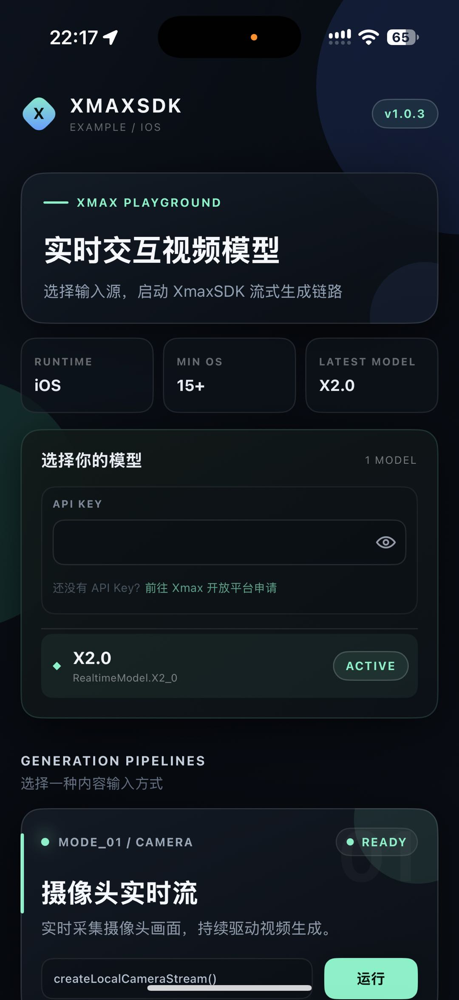
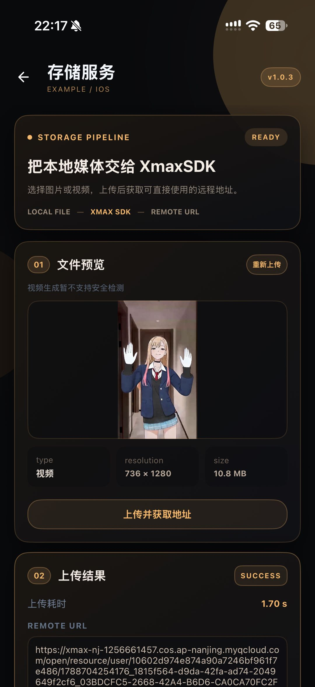

<p align="center">
  
</p>

<p align="center">
  
  
  
  
</p>

We introduce XmaxSDK, a React Native SDK designed for real-time interactive video generation via Xmax models. XmaxSDK implements an end-to-end pipeline covering media acquisition, video streaming, frame-by-frame generation, and on-device rendering, enabling developers to seamlessly integrate low-latency, high-fidelity video transformations into creative applications at a much lower cost than alternative solutions.

<!-- Product demos from the iOS XLab reference application. -->
<p align="center"></p>

<br>

## What you can build with XmaxSDK

<table>
  <tr>
    <th width="24%" align="left">Realtime Use Case</th>
    <th width="60%" align="left">Description</th>
    <th width="16%" align="center">Demo</th>
  </tr>
  <tr>
    <td rowspan="2" width="24%" valign="middle">
      <strong>Character Swapping</strong>
    </td>
    <td width="60%" valign="middle">
      Replace anyone in your live feed with a designated avatar in real-time.
    </td>
    <td rowspan="2" width="16%" align="center" valign="middle">
      <a href="https://cdn.jsdelivr.net/gh/XingMai/XmaxSDK-iOS@88182780abe60b3df1c44f549487fcf8ab4b660c/docs/videos/use-cases/character-swapping.mp4">
        
        <br>
        <sub>▶ Play demo</sub>
      </a>
    </td>
  </tr>
  <tr>
    <td width="60%" valign="middle">
      <strong>Prompt:</strong> <code>视频中角色替换成参考图中角色</code>
      <br><br>
      <strong>Reference image:</strong> Select a clear image of the desired character with a clean background.
    </td>
  </tr>
  <tr>
    <td rowspan="2" width="24%" valign="middle">
      <strong>Virtual Try-On</strong>
    </td>
    <td width="60%" valign="middle">
      Seamlessly change outfits, preserving exact body shape, natural motion, and an
      authentic fit.
    </td>
    <td rowspan="2" width="16%" align="center" valign="middle">
      <a href="https://cdn.jsdelivr.net/gh/XingMai/XmaxSDK-iOS@88182780abe60b3df1c44f549487fcf8ab4b660c/docs/videos/use-cases/virtual-try-on.mp4">
        
        <br>
        <sub>▶ Play demo</sub>
      </a>
    </td>
  </tr>
  <tr>
    <td width="60%" valign="middle">
      <strong>Prompt:</strong> <code>视频中人物衣服替换成参考图中衣服</code>
      <br><br>
      <strong>Reference image:</strong> Select a clear image of the target outfit with a clean background.
    </td>
  </tr>
  <tr>
    <td rowspan="2" width="24%" valign="middle">
      <strong>Video Restyling</strong>
    </td>
    <td width="60%" valign="middle">
      Reimagine your world in any style with an immersive visual experience.
    </td>
    <td rowspan="2" width="16%" align="center" valign="middle">
      <a href="https://cdn.jsdelivr.net/gh/XingMai/XmaxSDK-iOS@88182780abe60b3df1c44f549487fcf8ab4b660c/docs/videos/use-cases/video-restyling.mp4">
        
        <br>
        <sub>▶ Play demo</sub>
      </a>
    </td>
  </tr>
  <tr>
    <td width="60%" valign="middle">
      <strong>Prompt:</strong> <code>视频风格变为参考图指定的风格</code>
      <br><br>
      <strong>Reference image:</strong> Select an image that captures the artistic style you want to apply.
    </td>
  </tr>
  <tr>
    <td rowspan="2" width="24%" valign="middle">
      <strong>AI Companions</strong>
    </td>
    <td width="60%" valign="middle">
      Summon virtual characters into your live camera feed and interact with them
      through gestures.
    </td>
    <td rowspan="2" width="16%" align="center" valign="middle">
      <a href="https://cdn.jsdelivr.net/gh/XingMai/XmaxSDK-iOS@88182780abe60b3df1c44f549487fcf8ab4b660c/docs/videos/use-cases/ai-companions.mp4">
        
        <br>
        <sub>▶ Play demo</sub>
      </a>
    </td>
  </tr>
  <tr>
    <td width="60%" valign="middle">
      <strong>Prompt:</strong> <code>指定角色在场景中互动</code>
      <br><br>
      <strong>Reference image:</strong> Select a clear image of the virtual character you want to summon with a clean background.
    </td>
  </tr>
  <tr>
    <td rowspan="2" width="24%" valign="middle">
      <strong>Live Photo</strong>
    </td>
    <td width="60%" valign="middle">
      Animate and control characters in your images simply by drawing motion
      trajectories.
    </td>
    <td rowspan="2" width="16%" align="center" valign="middle">
      <a href="https://cdn.jsdelivr.net/gh/XingMai/XmaxSDK-iOS@4351aa869d4e24fd40690c670d8949bff270dee0/docs/videos/use-cases/live-photo.mp4">
        
        <br>
        <sub>▶ Play demo</sub>
      </a>
    </td>
  </tr>
  <tr>
    <td width="60%" valign="middle">
      <strong>Prompt:</strong> <code>让画面自然动起来</code>
      <br><br>
      <strong>Reference image:</strong> Use the input image as the reference
    </td>
  </tr>
</table>

<br>

## Why XmaxSDK?

<table>
  <thead>
    <tr>
      <th height="104" align="center" valign="middle">
        <br>Low latency
      </th>
      <th height="104" align="center" valign="middle">
        <br>Cost efficiency
      </th>
      <th height="104" align="center" valign="middle">
        <br>High fidelity
      </th>
    </tr>
  </thead>
  <tbody>
    <tr>
      <td>End-to-end latency is measured in , ensuring that updates to generation conditions and interaction controls are reflected instantly.</td>
      <td>Run on a , reducing inference costs by orders of magnitude versus datacenter GPUs like H100.</td>
      <td>Our models support real-time generation at up to , delivering production-ready, high-quality video output.</td>
    </tr>
  </tbody>
</table>

<br>

## Prerequisites

- iOS 15.1 or later / Android API 26 or later
- React Native 0.87.1 / React 19.2.3, New Architecture
- TypeScript 6
- An Xmax API key

> [!WARNING]
> Never commit your Xmax API key to version control. Pass it securely at
> runtime or use short-lived temporary keys issued by the Xmax API. For step-by-step
> instructions, see [Authentication](https://platform.xmaxai.com/docs/authentication).

<br>

## Installation

Run the included example through the **XLab workspace**.

From the repository root:

```sh
npm ci
```

For iOS, install CocoaPods dependencies:

```sh
bundle install
DEVELOPER_DIR=/Applications/Xcode.app/Contents/Developer npm run pods
```

Start Metro:

```sh
npm start
```

Keep Metro running and launch the app from another terminal:

```sh
# iPhone: configure your signing team in Xcode first.
DEVELOPER_DIR=/Applications/Xcode.app/Contents/Developer npm run ios -- --device "Your iPhone" --no-packager

# Android: connect a device or start an emulator.
npm run android -- --no-packager
```

The iOS workspace is [`Example/XLab/ios/XLab.xcworkspace`](./Example/XLab/ios/XLab.xcworkspace).
The pinned RTC binary does not include an arm64 iOS Simulator slice; use an iPhone
for the iOS example. Native dependency changes require rebuilding the app.

<br>

## Quick Start

### Configure permissions

Add a camera usage description to your application's `Info.plist`:

```xml
<key>NSCameraUsageDescription</key>
<string>This app uses the camera for real-time video input.</string>
```

Customize this message to match your application's user experience. XmaxSDK
automatically prompts for camera access when creating the video stream and throws
an `XmaxError` if permission is denied or unavailable.

<br>

For Android, add permissions to your application's `AndroidManifest.xml`:

```xml
<uses-permission android:name="android.permission.CAMERA" />
<uses-permission android:name="android.permission.RECORD_AUDIO" />
<uses-permission android:name="android.permission.INTERNET" />
```

If enabling microphone input, also add `NSMicrophoneUsageDescription` to the iOS
`Info.plist`. XLab already includes this configuration.

<br>

### Generate and display video

The following TypeScript snippet creates a camera stream, starts real-time generation,
and binds the output to a video view. Run this within an async screen action.

```tsx
import {
  XmaxClient,
  XmaxEnvironment,
  RealtimeModel,
  CameraPosition,
} from '@xmaxai/react-native-sdk';

const client = new XmaxClient({
  apiKey: 'YOUR_XMAX_API_KEY',
  environment: XmaxEnvironment.global,
});

const realtime = client.createRealtimeManager({
  model: RealtimeModel.x2_0,
});

const localStream = await realtime.createLocalCameraStream({
  position: CameraPosition.front,
});
setLocalTrack(localStream.videoTrack);

const remoteStream = await realtime.connect({ localStream });
setRemoteTrack(remoteStream.videoTrack);

// Bind the remote track before waiting for generation confirmation.
await realtime.startGeneration({
  context: {
    prompt: '视频中角色替换成参考图中角色',
    referencePath: 'https://platform.xmaxai.com/images/source/charx/chatx_image1.jpg',
  },
});
```

The view shows local preview until remote generation is ready, with touch
interaction enabled by default.

Choose `XmaxEnvironment.china` or `XmaxEnvironment.global` to match your API key;
the default is `china`. Use `RealtimeModel.x2_0_pro` to select X2.0 Pro.
Keep the client and manager stable for the screen's lifetime.

<br>

### Using React Native

Use `XmaxRealtimeVideo` as your primary React Native view. Store the local and remote
tracks in React state, updating them dynamically as streams become available:

```tsx
import { useState } from 'react';
import {
  XmaxRealtimeVideo,
  VideoContentMode,
  type RealtimeVideoTrack,
} from '@xmaxai/react-native-sdk';

// Inside your screen component:
const [localTrack, setLocalTrack] = useState<RealtimeVideoTrack | null>(null);
const [remoteTrack, setRemoteTrack] = useState<RealtimeVideoTrack | null>(null);

<XmaxRealtimeVideo
  localTrack={localTrack}
  remoteTrack={remoteTrack}
  videoContentMode={VideoContentMode.fill}
  style={{ flex: 1 }}
/>
```

See the [example project](#example-project) for state binding and a complete implementation.

<br>

### Listen for events

After creating `realtime`, register the listeners you need before creating the
input stream or starting generation.

| Listener | Purpose |
| --- | --- |
| `setStateListener` | Observe pipeline states and termination reasons during real-time generation. |
| `setNetworkQualityListener` | Monitor uplink and downlink network quality. |
| `setPerformanceAlarmListener` | Detect device performance limitations or recovery, with a suggested video format when available. |

For example, monitor state changes and errors:

```ts
await realtime.setStateListener(state => {
  setConnectionState(state.connectionState);
  if (state.reason?.type === 'failure') {
    const error = state.reason.error;
    setErrorMessage(`${error.code} ${error.message}`);
  }
});
```

Handle rejected async calls with `try/catch` and normalize errors with
`XmaxError.from(error)`. Lifecycle and cleanup failures are reported through
`state.reason` after cleanup completes.

For camera input, bind the returned video track to a preview view. The SDK enters
`Ready` after receiving a valid frame and binding the preview; observe this
through `setStateListener`.

<br>

### Resource Cleanup

- **`disconnect()` — Stop Remote Generation**

  Stops remote generation, leaves the RTC room and requests server-session closure
  while keeping the local camera or image stream and preview active. Use this when
  ending the online session but staying on the current screen. You can start a new
  session later using the same local stream:

  ```ts
  await realtime.disconnect()
  ```

- **`close()` — Full Teardown & Release**

  Ends the remote session, stops local media capture, and releases all engine
  resources. Use this when leaving or dismissing the generation screen:

  ```ts
  await realtime.close()
  ```

> **Note:** These methods are alternatives, not sequential steps. When exiting a
> screen, call `close()` directly—there is no need to call `disconnect()` first.

Backgrounding also closes realtime resources; recreate local media when returning.

<br>

> [!TIP]
> For complete examples, including image input, reference images and custom
> touch effects, see the [example project](./Example/XLab).

<br>

## Example Project

A complete example application featuring a React Native implementation
is available in [`Example/XLab`](./Example/XLab).
It demonstrates real-time generation using live camera feeds and static images.

<p align="center"></p>

<br>

## Dependencies

- <ins><strong>VolcEngine RTC SDK</strong></ins> enables low-latency, real-time audio and video communication.
- <ins><strong>Tencent Cloud COS SDK</strong></ins> handles media upload and download via object storage.

See [`package.json`](./package.json) for dependency versions.

<br>

## Contact us

For bug reports and feature requests, please open a
[GitHub Issue](https://github.com/XingMai/XmaxSDK-RN/issues). For integration
assistance and technical support, contact us at [sdk@xmax.ai](mailto:sdk@xmax.ai).

<br>

## License

XmaxSDK is available under the terms of the [MIT License](LICENSE).
